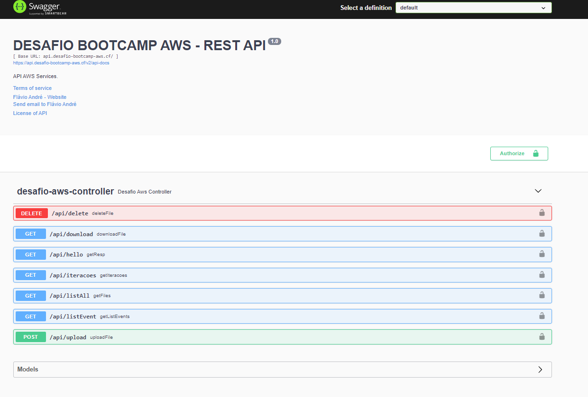

[](https://gitpod.io/#https://github.com/FlavioAndre/desafio-cloud-aws/tree/main/desafio-aws-backend)
[](https://github.com/FlavioAndre/desafio-cloud-aws/blob/main/LICENSE)
[](https://dev.azure.com/desenvapps2014/desafio-bootcamp-aws/_build/latest?definitionId=4&branchName=main)


# desafio-aws-backend


## Configuração de ambiente

Antes de rodar a aplicação é necessário configurar as seguintes vaviáveis de ambiente:

```bash
jwt_aws_userPoolId=us-${jwt_aws_userPoolId}
jwt_aws_region=${jwt_aws_region}
jwt_aws_urlWellKnown=https://cognito-idp.{0}.amazonaws.com/{1}/.well-known/jwks.json
jwt_aws_urlCognito=https://cognito-idp.{0}.amazonaws.com/{1}
aws_s3_bucket=${aws_s3_bucket}
aws_s3_accessKey=${aws_s3_accessKey}
aws_s3_secretKey=${aws_s3_secretKey}
aws_dynamodb_endpoint=${aws_dynamodb_endpoint}
aws_dynamodb_region=${aws_dynamodb_region}
max_file_size=${max_file_size}
```

MVN Execute o seguintes comandos para rodar a aplicação

```bash
mvn clean package
java -jar target/desafio-aws-amcom-0.0.1-SNAPSHOT.jar
```


Docker 0- Execute o seguintes comandos para rodar a aplicação

```bash
docker build -t desafio-aws-back .
docker run -d -p 8081:8081 --env-file seudiretorio\arquivoComAsVariaveisDeAmbiente\env.dev

```
