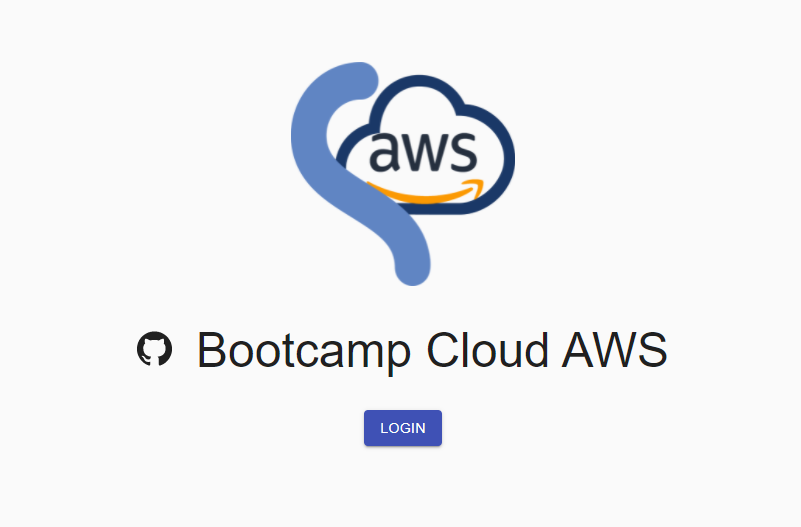

[](https://gitpod.io/#https://github.com/FlavioAndre/desafio-cloud-aws/tree/main/desafio-aws-fronted)
[](https://github.com/FlavioAndre/desafio-cloud-aws/blob/main/LICENSE)
[](https://dev.azure.com/desenvapps2014/desafio-bootcamp-aws/_build/latest?definitionId=3&branchName=main)


# desafio-aws-fronted



## Configuração de ambiente

Antes de rodar a aplicação é necessário configuras as seguintes vaviáveis de ambiente:

```bash
REACT_APP_USERPOOL_ID=${REACT_APP_USERPOOL_ID}
REACT_APP_CLIENT_ID=${REACT_APP_CLIENT_ID}
REACT_APP_BASE_URL=${REACT_APP_BASE_URL}
NODE_ENV=${NODE_ENV}
```

Execute o seguintes comandos para rodar a aplicação

```bash
cd app
npm install
npm start
```

Docker - Execute o seguintes comandos para rodar a aplicação

```bash
docker-compose up --detach
```

Docker - Execute o seguintes comandos para parar a aplicação

```bash
docker-compose down
```

## Referências

<https://www.npmjs.com/package/amazon-cognito-identity-js>

<https://docs.aws.amazon.com/cdk/api/latest/docs/aws-cognito-readme.html>

<https://docs.aws.amazon.com/cognito/latest/developerguide/cognito-user-pools-social-idp.html>

<https://docs.aws.amazon.com/cdk/latest/guide/getting_started.html>
